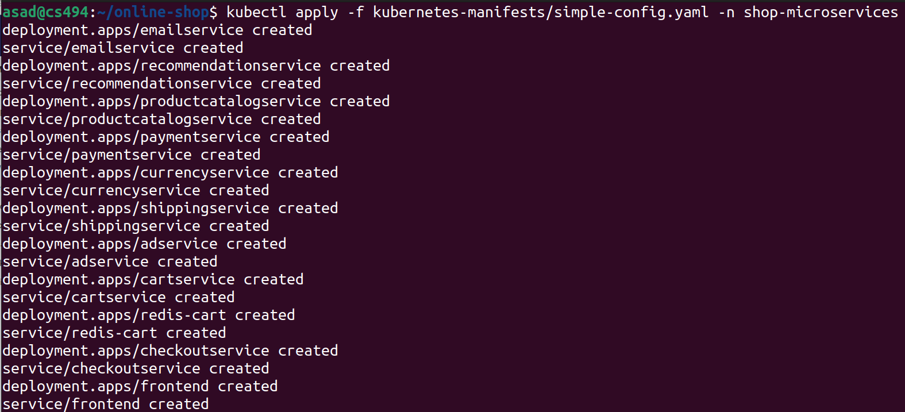
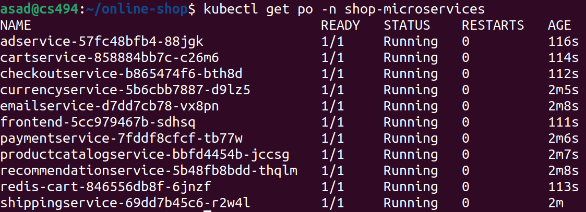
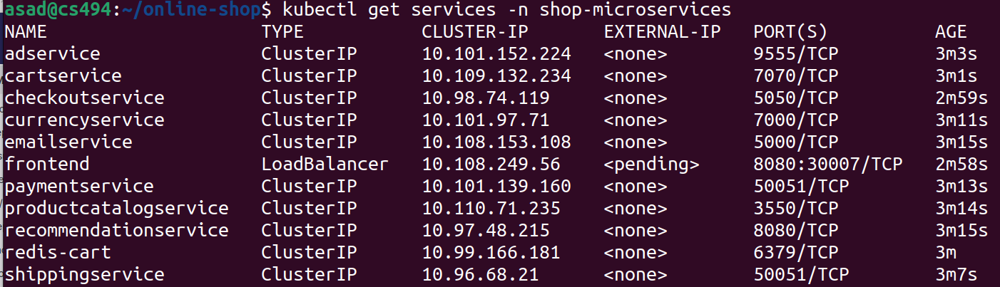

# Microservices based E-Commerce App - Deployed on Kubernetes

In this demo application, we are going to deploy a **microservices** based **E-Commerce** web application with **11** microservices on Kubernetes.

Application credit to [Google Cloud Platform](https://github.com/GoogleCloudPlatform/microservices-demo).

## Description 
**Online Boutique** is a cloud-native microservices demo application. Online Boutique consists of a 11-tier microservices application. The application is a web-based e-commerce app where users can browse items, add them to the cart, and purchase them.

**Google uses this application to demonstrate use of technologies like Kubernetes/GKE, Istio, Stackdriver, gRPC and OpenCensus**. This application works on any Kubernetes cluster, as well as Google Kubernetes Engine. It’s easy to deploy with little to no configuration.

## Architecture
Online Boutique is composed of 11 microservices written in different languages that talk to each other over gRPC.


## Microservices Detail
As a DevOps engineer, we need following information from the developer, to deploy the Microservices:
- Which microservices need to be deployed?
- Which microservice is talking to which microservice? 
- How are they communicating? 
  - Directly using API calls
  - Message Broker
  - Service Mesh 
- Which database are they using? 3rd Party Services
- On which port does each microservice run? 
- Which service is accessible form outside the K8s cluter?

**Note:** In this microservices demo, Redis as a Message Broker or in-memory database is being used. 

### Brief Description of Microservices

|Microservice |Language |Description             |
|----------|-------|----------------------------| 
| frontend     | Go | Exposes an HTTP server to serve the website. Does not require signup/login and generates session IDs for all users automatically.|
| cartservice  | C# | Stores the items in the user's shopping cart in Redis and retrieves it. |
| productcatalogservice  | Go | Provides the list of products from a JSON file and ability to search products and get individual products. |
| currencyservice  | Nodejs | Converts one money amount to another currency. Uses real values fetched from European Central Bank. It's the highest QPS service. |
| paymentservice  | Nodejs | Charges the given credit card info (mock) with the given amount and returns a transaction ID. |
| shippingservice  | Go | Gives shipping cost estimates based on the shopping cart. Ships items to the given address (mock). |
| emailservice  | Python | Sends users an order confirmation email (mock). |
| checkoutservice  | Go | Retrieves user cart, prepares order and orchestrates the payment, shipping and the email notification. |
| recommendationservice  | Python | Recommends other products based on what's given in the cart. |
| adservice  | Java | Provides text ads based on given context words. |
| loadgenerator  | Python/Locust | Continuously sends requests imitating realistic user shopping flows to the frontend. |

### Microservices Ports and Env. Variables

|Microservice |Working on Port | Env. Variables | Image Path |
|----------|--------|-------------|-------------|
| frontend     | 8080 | PORT="8080" -  PRODUCT_CATALOG_SERVICE_ADDR="productcatalogservice:3550" CURRENCY_SERVICE_ADDR="currencyservice:7000" CART_SERVICE_ADDR="cartservice:7070" RECOMMENDATION_SERVICE_ADDR="recommendationservice:8080" SHIPPING_SERVICE_ADDR="shippingservice:50051" CHECKOUT_SERVICE_ADDR="checkoutservice:5050" AD_SERVICE_ADDR="adservice:9555"    | gcr.io/google-samples/microservices-demo/frontend:v0.6.0    |
| cartservice  | 7070 | PORT="7070" -  REDIS_ADDR="redis-cart:6379"    | gcr.io/google-samples/microservices-demo/cartservice:v0.6.0    |
| productcatalogservice  | 3550 | PORT="3550"    | gcr.io/google-samples/microservices-demo/productcatalogservice:v0.6.0    |
| currencyservice  | 7000 | PORT="7000"    | gcr.io/google-samples/microservices-demo/currencyservice:v0.6.0    |
| paymentservice  | 50051 | PORT="50051"    | gcr.io/google-samples/microservices-demo/paymentservice:v0.6.0    |
| shippingservice  | 50051 | PORT="50051"    | gcr.io/google-samples/microservices-demo/shippingservice:v0.6.0    |
| emailservice  | 8080 | PORT="8080"    | gcr.io/google-samples/microservices-demo/emailservice:v0.6.0    |
| checkoutservice  | 5050 | PORT="5050" -  PRODUCT_CATALOG_SERVICE_ADDR="productcatalogservice:3550" SHIPPING_SERVICE_ADDR="shippingservice:50051" PAYMENT_SERVICE_ADDR="paymentservice:50051" EMAIL_SERVICE_ADDR="emailservice:5000" CURRENCY_SERVICE_ADDR="currencyservice:7000" CART_SERVICE_ADDR="cartservice:7070"    | gcr.io/google-samples/microservices-demo/checkoutservice:v0.6.0    |
| recommendationservice  | 8080 | PORT="8080" -  PRODUCT_CATALOG_SERVICE_ADDR="productcatalogservice:3550"    | gcr.io/google-samples/microservices-demo/recommendationservice:v0.6.0    |
| adservice  | 9555 | PORT="9555"    | gcr.io/google-samples/microservices-demo/adservice:v0.6.0    |
| loadgenerator  |  | FRONTEND_ADDR="frontend:80" - USERS="10"    | gcr.io/google-samples/microservices-demo/loadgenerator:v0.6.0    |

## Create Deployment and Service Configurations
In this section we are going to create **Deployment** and **Service** configuration files for all microservices. 

For simplicity we'll create a single manifest file, i.e. `kubernetes-manifests/simple-config.yaml`, for all microservices, so that we can deploy them in a single go. 

### Email Service Manifest

```
apiVersion: apps/v1
kind: Deployment
metadata:
  name: emailservice
spec:
  selector:
    matchLabels:
      app: emailservice
  template:
    metadata:
      labels: 
        app: emailservice
    spec:
      containers:
      - name: service
        image: gcr.io/google-samples/microservices-demo/emailservice:v0.6.0
        ports: 
        - containerPort: 8080
        env:
        - name: PORT
          value: "8080"
---
apiVersion: v1
kind: Service
metadata:
  name: emailservice
spec:
  type: ClusterIP
  selector:
    app: emailservice
  ports:
  - protocol: TCP 
    port: 5000
    targetPort: 8080
```

### Recommendation Service Manifest

```
apiVersion: apps/v1
kind: Deployment
metadata:
  name: recommendationservice
spec:
  selector:
    matchLabels:
      app: recommendationservice
  template:
    metadata: 
      labels:
        app: recommendationservice
    spec:
      containers:
      - name: service
        image: gcr.io/google-samples/microservices-demo/recommendationservice:v0.6.0
        ports: 
        - containerPort: 8080
        env:
        - name: PORT
          value: "8080"
        - name: PRODUCT_CATALOG_SERVICE_ADDR
          value: "productcatalogservice:3550"
---
apiVersion: v1
kind: Service
metadata:
  name: recommendationservice
spec:
  type: ClusterIP
  selector:
    app: recommendationservice
  ports:
  - protocol: TCP 
    port: 8080
    targetPort: 8080
```

### Product Catalog Service Manifest

```
apiVersion: apps/v1
kind: Deployment
metadata:
  name: productcatalogservice
spec:
  selector:
    matchLabels:
      app: productcatalogservice
  template:
    metadata:
      labels:
        app: productcatalogservice
    spec:
      containers:
      - name: service
        image: gcr.io/google-samples/microservices-demo/productcatalogservice:v0.6.0
        ports: 
        - containerPort: 3550
        env:
        - name: PORT
          value: "3550"
---
apiVersion: v1
kind: Service
metadata:
  name: productcatalogservice
spec:
  type: ClusterIP
  selector:
    app: productcatalogservice
  ports:
  - protocol: TCP 
    port: 3550
    targetPort: 3550
```

### Payment Service Manifest

```
apiVersion: apps/v1
kind: Deployment
metadata:
  name: paymentservice
spec:
  selector:
    matchLabels:
      app: paymentservice
  template:
    metadata:
      labels:
        app: paymentservice
    spec:
      containers:
      - name: service
        image: gcr.io/google-samples/microservices-demo/paymentservice:v0.6.0
        ports: 
        - containerPort: 50051
        env:
        - name: PORT
          value: "50051"
---
apiVersion: v1
kind: Service
metadata:
  name: paymentservice
spec:
  type: ClusterIP
  selector:
    app: paymentservice
  ports:
  - protocol: TCP 
    port: 50051
    targetPort: 50051
```

### Currency Service Manifest

```
apiVersion: apps/v1
kind: Deployment
metadata:
  name: currencyservice
spec:
  selector:
    matchLabels:
      app: currencyservice
  template:
    metadata:
      labels:
        app: currencyservice
    spec:
      containers:
      - name: service
        image: gcr.io/google-samples/microservices-demo/currencyservice:v0.6.0
        ports: 
        - containerPort: 7000
        env:
        - name: PORT
          value: "7000"
---
apiVersion: v1
kind: Service
metadata:
  name: currencyservice
spec:
  type: ClusterIP
  selector:
    app: currencyservice
  ports:
  - protocol: TCP 
    port: 7000
    targetPort: 7000
```

### Shipping Service Manifest

```
apiVersion: apps/v1
kind: Deployment
metadata:
  name: shippingservice
spec:
  selector:
    matchLabels:
      app: shippingservice
  template:
    metadata:
      labels:
        app: shippingservice
    spec:
      containers:
      - name: service
        image: gcr.io/google-samples/microservices-demo/shippingservice:v0.6.0
        ports: 
        - containerPort: 50051
        env:
        - name: PORT
          value: "50051"
---
apiVersion: v1
kind: Service
metadata:
  name: shippingservice
spec:
  type: ClusterIP
  selector:
    app: shippingservice
  ports:
  - protocol: TCP 
    port: 50051
    targetPort: 50051
```

### Ad Service Manifest

```
apiVersion: apps/v1
kind: Deployment
metadata:
  name: adservice
spec:
  selector:
    matchLabels:
      app: adservice
  template:
    metadata:
      labels:
        app: adservice
    spec:
      containers:
      - name: service
        image: gcr.io/google-samples/microservices-demo/adservice:v0.6.0
        ports: 
        - containerPort: 9555
        env:
        - name: PORT
          value: "9555"
---
apiVersion: v1
kind: Service
metadata:
  name: adservice
spec:
  type: ClusterIP
  selector:
    app: adservice
  ports:
  - protocol: TCP 
    port: 9555
    targetPort: 9555
```

### Cart Service Manifest

```
apiVersion: apps/v1
kind: Deployment
metadata:
  name: cartservice
spec:
  selector:
    matchLabels:
      app: cartservice
  template:
    metadata:
      labels:
        app: cartservice
    spec:
      containers:
      - name: service
        image: gcr.io/google-samples/microservices-demo/cartservice:v0.6.0
        ports: 
        - containerPort: 7070
        env:
        - name: PORT
          value: "7070"
        - name: REDIS_ADDR
          value: "redis-cart:6379"
---
apiVersion: v1
kind: Service
metadata:
  name: cartservice
spec:
  type: ClusterIP
  selector:
    app: cartservice
  ports:
  - protocol: TCP 
    port: 7070
    targetPort: 7070
```

### Redis Cart Manifest

```
apiVersion: apps/v1
kind: Deployment
metadata:
  name: redis-cart
spec:
  selector:
    matchLabels:
      app: redis-cart
  template:
    metadata:
      labels:
        app: redis-cart
    spec:
      containers:
      - name: redis
        image: redis:alpine
        ports: 
        - containerPort: 6379
        volumeMounts:
        - name: redis-data
          mountPath: /data
      volumes: 
      - name: redis-data
        emptyDir: {}
---
apiVersion: v1
kind: Service
metadata:
  name: redis-cart
spec:
  type: ClusterIP
  selector:
    app: redis-cart
  ports:
  - protocol: TCP 
    port: 6379
    targetPort: 6379
```

### Checkout Service Manifest

```
apiVersion: apps/v1
kind: Deployment
metadata:
  name: checkoutservice
spec:
  selector:
    matchLabels:
      app: checkoutservice
  template:
    metadata:
      labels:
        app: checkoutservice
    spec:
      containers:
      - name: service
        image: gcr.io/google-samples/microservices-demo/checkoutservice:v0.6.0
        ports: 
        - containerPort: 5050
        env:
        - name: PORT
          value: "5050"
        - name: PRODUCT_CATALOG_SERVICE_ADDR
          value: "productcatalogservice:3550"
        - name: SHIPPING_SERVICE_ADDR
          value: "shippingservice:50051"
        - name: PAYMENT_SERVICE_ADDR
          value: "paymentservice:50051"
        - name: EMAIL_SERVICE_ADDR
          value: "emailservice:5000"
        - name: CURRENCY_SERVICE_ADDR
          value: "currencyservice:7000"
        - name: CART_SERVICE_ADDR
          value: "cartservice:7070"
---
apiVersion: v1
kind: Service
metadata:
  name: checkoutservice
spec:
  type: ClusterIP
  selector:
    app: checkoutservice
  ports:
  - protocol: TCP 
    port: 5050
    targetPort: 5050
```

### Frontend Service Manifest

```
apiVersion: apps/v1
kind: Deployment
metadata:
  name: frontend
spec:
  selector:
    matchLabels:
      app: frontend
  template:
    metadata:
      labels:
        app: frontend
    spec:
      containers:
      - name: service
        image: gcr.io/google-samples/microservices-demo/frontend:v0.6.0
        ports: 
        - containerPort: 8080
        env:
        - name: PORT
          value: "8080"
        - name: PRODUCT_CATALOG_SERVICE_ADDR
          value: "productcatalogservice:3550"
        - name: CURRENCY_SERVICE_ADDR
          value: "currencyservice:7000"
        - name: CART_SERVICE_ADDR
          value: "cartservice:7070"
        - name: RECOMMENDATION_SERVICE_ADDR
          value: "recommendationservice:8080"
        - name: SHIPPING_SERVICE_ADDR
          value: "shippingservice:50051"
        - name: CHECKOUT_SERVICE_ADDR
          value: "checkoutservice:5050"
        - name: AD_SERVICE_ADDR
          value: "adservice:9555"
---
apiVersion: v1
kind: Service
metadata:
  name: frontend
spec:
  type: LoadBalancer
  selector:
    app: frontend
  ports:
  - protocol: TCP 
    port: 8080
    targetPort: 8080
    nodePort: 30007
```

## Deploying Microservices into K8s Cluster
It is time to deploy all microservices into the K8s cluster, i.e. Minikube. 

Before deployment let us create a separate namespace, so that all microservices work under this namespace. 

### Create Namespace
Run following command to create namespace. 

`kubectl create namespace shop-microservices`

### Deploy Microservices
Run following command to deploy all microservices. 

`kubectl apply -f simple-config.yaml -n shop-microservices`

### Application Screenshots 








