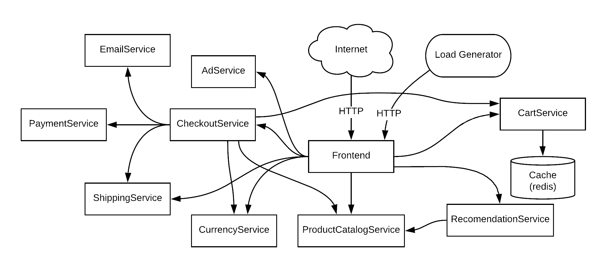

# Microservices based E-Commerce App - Deployed on Kubernetes

In this demo application, we are going to deploy a **microservices** based **E-Commerce** web application with **11** microservices on Kubernetes.

Application credit to [Google Cloud Platform](https://github.com/GoogleCloudPlatform/microservices-demo).

## Description 
**Online Boutique** is a cloud-native microservices demo application. Online Boutique consists of a 11-tier microservices application. The application is a web-based e-commerce app where users can browse items, add them to the cart, and purchase them.

**Google uses this application to demonstrate use of technologies like Kubernetes/GKE, Istio, Stackdriver, gRPC and OpenCensus**. This application works on any Kubernetes cluster, as well as Google Kubernetes Engine. It’s easy to deploy with little to no configuration.

## Architecture
Online Boutique is composed of 11 microservices written in different languages that talk to each other over gRPC.

## Microservices Detail
As a DevOps engineer, we need following information from the developer, to deploy the Microservices:
- Which microservices need to be deployed?
- Which microservice is talking to which microservice? 
- How are they communicating? 
  - Directly using API calls
  - Message Broker
  - Service Mesh 
- Which database are they using? 3rd Party Services
- On which port does each microservice run? 
- Which service is accessible form outside the K8s cluter?

In this microservices demo, Redis as a Message Broker or in-memory database is being used. 

|Microservice |Language|Working on Port | Env. Variables | Image Path | Description                    |
|----------|----------|-----------|-------------|-------------|--------------------| 
| frontend     | Go | 8080 |     |     | Exposes an HTTP server to serve the website. Does not require signup/login and generates session IDs for all users automatically.|
| cartservice  | C# | 7070 |     |     | Stores the items in the user's shopping cart in Redis and retrieves it. |
| productcatalogservice  | Go | 3550 |     |     | Provides the list of products from a JSON file and ability to search products and get individual products. |
| currencyservice  | Nodejs | 7000 |     |     | Converts one money amount to another currency. Uses real values fetched from European Central Bank. It's the highest QPS service. |
| paymentservice  | Nodejs | 50051 |     |     | Charges the given credit card info (mock) with the given amount and returns a transaction ID. |
| shippingservice  | Go | 50051 |     |     | Gives shipping cost estimates based on the shopping cart. Ships items to the given address (mock). |
| emailservice  | Python | 8080 |     |     | Sends users an order confirmation email (mock). |
| checkoutservice  | Go | 5050 |     |     | Retrieves user cart, prepares order and orchestrates the payment, shipping and the email notification. |
| recommendationservice  | Python | 8080 |     |     | Recommends other products based on what's given in the cart. |
| adservice  | Java | 9555 |     |     | Provides text ads based on given context words. |
| loadgenerator  | Python/Locust |  |     |     | Continuously sends requests imitating realistic user shopping flows to the frontend. |

